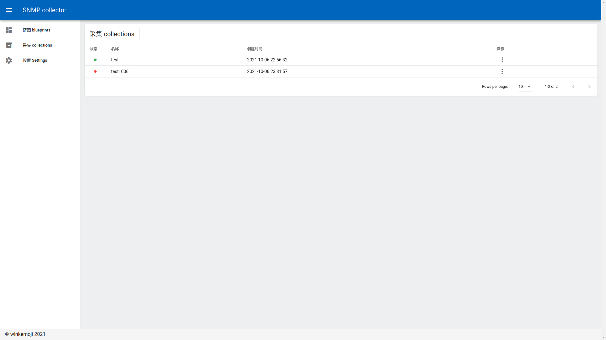

# 用户手册

## 目录

- <a href="#intro">SNMP Collector简介</a>
- <a href="#deploy">部署</a>
- <a href="#arc">架构</a>
- <a href="#use">快速使用</a>
- <a href="#api">API文档</a>

## <a name="intro">1 SNMP Collector简介</a>

`Snmp Collector `是基于`SNMP`协议`v3`版本的数据采集工具，用于对大量的路由器或交换机进行数据获取，解析，并存储。支持多个采集同时进行，用于满足不同区域机器的统一管理需求。

## <a name="deploy">2 部署</a>

`Snmp Collector`提供两种部署方式，一种是在本地环境部署，另一种使用容器部署，接下来详细介绍两种部署方式。

### 2.1 提前准备

安装`MongoDB`并创建用户。

### 2.1 本地环境部署

安装`snmpd`，`RabbitMQ`。

 `apt-get`安装`snmp`,`snmpd`,`RabbitMQ`命令如下,其中`snmp`选择安装。

```shell
apt-get update  && apt-get install snmp snmpd erlang rabbitmq-server -y
```

将根目录下`requirements.txt`内所有包安装到您的python环境中。

```shell
pip install -r requirements.txt
```

安装好所有依赖后启动根目录下的`start.py`文件。

```shell
nohup python start.py &
```

启动后浏览器访问`http://localhost:4400/`出现 `snmp collector superserver is running.`即启动成功。

### 2.2 docker部署（推荐）

系统中确认安装`docker`后，打开控制台输入以下命令。

```shell
docker pull winkemoji/snmp-collector:latest
docker run -it -d --name snmp-collector  -p 4400:4400 -p 4399:4399  -e TZ=Asia/Shanghai snmp-collector
```

`SC Control Plane` 是针对`Snmp Collector`的可视化工具，使用它可以方便的对`Snmp Collector`进行操作与管理。

```shell
docker pull winkemoji/sc-control-plane:latest
docker run -it -d --name sc-control-plane  -e SC_HOST='192.168.230.72'  -p 15674:80   -e TZ=Asia/Shanghai winkemoji/sc-control-plane
```

`Snmp Collector` 使用端口`4399`，`4400`， `SC Control Plane` 使用端口`15674`,若需要远程访问`Snmp Collector` 需环境变量`SC_HOST`指定`Snmp Collector`服务器ip地址，默认为`localhost`。

启动两个容器后浏览器访问`http://localhost:15674/`即可。

## <a name="arc">3 架构</a>


<center>图3.1 SNMP Collector系统架构</center>

`Snmp Collector` 系统架构如图3.1所示，`snmp collector engine`向上通过`api server`向外暴露统一的RESTful API 接口面向用户或`superserver`,`snmp collector engine`向下创建并管理多个采集实例`collection`,一个`collection`由三个模块组成，模块之间使用消息中间件`rabbitmq`异步通信，避免采集的信息来不及处理，影响采集效率，同时为确保采集实例正确采集，对用户提供监视器`monitor`监视采集中各个模块运行状况，便于及时调整。

### 3.1 superserver

在运行过程中如果`snmp collector`修改了相关配置或服务异常需要重新启动，这时候就需要`superserver`帮忙，对`snmp collector`可进行的操作及对应的接口如表3.1。注意！重启`snmp collector`后原来正在运行的采集都会删除，需手动根据蓝图组装采集并运行。

<center>表3.1 superserver可进行操作与对应接口

| 操作               | 接口            |
| ------------------ | --------------- |
| 获取,更新配置      | /config         |
| 获取默认配置       | /default-config |
| 重启snmp collector | /restart        |
</center>

### 3.2 snmp collector engine

`snmp collector engine`对创建的采集进行统一管理，可进行的操作及对应的接口如表3.2。

<center>表3.1 snmp collector engine可进行操作与对应接口

| 操作     | 接口                                     |
| -------- | ---------------------------------------- |
| 启动采集 | /api/collections/start/{collection_id}   |
| 重启采集 | /api/collections/restart/{collection_id} |
| 删除采集 | /api/collections/{collection_id}         |
| 停止采集 | /api/collections/stop/{collection_id}    |
</center>

### 3.3 collection

采集是整个系统的核心，通过`snmp collector engine` 根据蓝图生成采集实例，一个采集由三个模块组成，每个模块各运行一个进程，收集数据模块`collect data module`,解析数据模块`parse data module`和保存数据模块`save data module`，模块之间通过消息中间件`rabbitmq`进行通信，`snmp collector engine`直接向收集数据模块发送指令，不与解析数据模块，保存数据模块直接通信。

收集数据模块`collect data module`通过线程异步调用snmpd命令进行数据获取（支持 `snmp get` 与 `snmp walk`），将获取到的信息直接交给`rabbitmq`处理，避免对采集的大量信息处理过长导致进程阻塞，影响马上到来的下一次采集。

数据解析模块`parse data module`获取数据收集模块的数据，用户提供一定的规则，对获取的数据进行下一步加工，比如，将采集到的两个值进行拼接，过滤掉为0的值，等等。保证存入数据库中数据的规范性，简洁性。

数据保存模块`save data module`得到解析后的数据将其保存至`mongoDB`中,数据库中集合名称为当前日期(如2021-10-03)，并且每天都会创建新的集合，用于保存新一天采集得到的数据。注，切换集合时收集数据模块不受影响，保证采集的准时性。

### 3.4 monitor

当我们的采集正常运行时，可在数据库中正常获取到数据，当创建的采集非正常运行时，查看日志是一种方法，但我们更希望可以快速实时的看到各个模块的输入输出与日志，用于判断哪个模块的配置出现问题，以便及时调整，因此提供给用户监视器`monitor`,监视器直接与消息中间件`rabbitmq`进行通信，`rabbitmq`采用`topic`模式， 因此可以灵活的获取单个模块或多个模块的输入输出与日志。

### 3.5 user interface

``SC Control Plane``是`user interface`的一个简单实现，调用`superserver`与`api server`接口，给用户提供便捷的交互方式。

## <a name="use">4 快速使用</a>

### 4.1 提前准备

`snmp-collector`，`SC Control Plane`已正确部署，还需有配置了SNMPv3的路由器或交换机,如没有可在本机进行测试(本机需安装`snmp`)。

### 4.2  创建蓝图

打开`SC Control Plane`, 浏览器中访问`http://ip:15674/blueprints`,其中ip为服务器地址，打开界面如图4.1所示。


<center>图4.1 蓝图界面</center>

点击图4.1右上角**新建蓝图**按钮，打开创建蓝图界面，填写蓝图名称，标签，在数据采集标签下添加oid, agents,设置采集间隔，设置默认登录凭证，数据解析标签不用修改，数据保存标签下配置MongoDB数据库，如图4.2所示，如果配置有问题可将**附录1**复制到JSON标签下的编辑器中，并点击更新JSON，会自动填充一些信息，再继续修改，创建成功后点击保存，可看到新创建的蓝图（test1006）。

### 4.3 启动采集

对应条目下点击**操作**按钮,选择**组装**(如图4.1)，可在采集页面看到刚由蓝图组装的采集（如图4.3）。注意，`binding_key`与`routing_keys`默认不清楚请不要修改，以免监视器无法取到正确的`binding_key`也不建议直接在JSON编辑器中修改，可能会跳过一些校验。


<center>图4.2 创建蓝图界面</center>

在采集界面下(图4.3)对刚生成的采集点击**操作**按钮,选择**启动**, 如果采集顺利，可以在数据库可视化软件中看到采集信息，见**图A.1**,**图A.2**。



<center>图4.3 采集界面</center>

### 4.4 使用监视器

如果采集未能顺利进行，可启动监视器查看出现的问题,监视器的配置十分灵活，监视器在项目根目录monitor文件夹下，docker容器打开监视器命令如下。其中`collection_name`为采集名称，`binding_key`为绑定的键，可选值如表4.1。

```shell
docker exec -it snmp-collector /bin/bash
cd /snmp-collector/monitor
python monitor.py [collection_name] [binding_key]...
```

<center>表4.1 binding_key 可取值及对应含义

| binding_key    | description                            |
| -------------- | -------------------------------------- |
| module.c       | 监视collect data module 产生数据       |
| module.p       | 监视parse data module 产生数据         |
| module.#       | 监视所有模块产生数据                   |
| log.c          | 监视collect data module 产生日志       |
| log.p          | 监视parse data module 产生日志         |
| log.s          | 监视save data module产生日志           |
| log.#          | 监视所有模块产生日志                   |
| module.# log.# | 监视所有模块数据与日志                 |
| module.c log.c | 监视collect data module 产生日志与数据 |
| ...            |                                        |
</center>

监视器使用举例：

```
python monitor.py test module.c
python monitor.py test module.# log.#
python monitor.py test log.c
...
```

监视器正常启动与输出见图4.4。


<center>图4.4 监视器界面</center>

## <a name="api">5 API文档</a>

`SNMP Collector` 只提供数据采集功能，如您需要针对其进行二次开发，提供更丰富的功能，可参考api文档。

[SNMP Collector api index.md](https://github.com/winkemoji/snmp-collector/blob/master/doc/api-index.md)

## 附录

### 附录1

```json
{
  "unique_name": "test1006",
  "modules": {
    "collect_data": {
      "binding_key": "module.c",
      "routing_keys": [
        "module.p",
        "log.c"
      ],
      "collect_interval": 1,
      "snmp_credentials": {
        "version": "v3",
        "username": "snmp-user",
        "auth_protocol": "SHA",
        "auth_pass": "",
        "priv_protocol": "AES",
        "priv_pass": ""
      },
      "oids": [
        {
          "name": "entPhysicalName",
          "description": "物理实体名",
          "oid": "1.3.6.1.2.1.47.1.1.1.1.7.67108867",
          "operation": "get"
        }
      ],
      "agents": [
        {
          "ip": "172.16.2.201",
          "use_default_credentials": false,
          "credentials": {
            "username": "snmp-user",
            "auth_protocol": "SHA",
            "auth_pass": "cclg_snmpv3",
            "priv_protocol": "AES",
            "priv_pass": "cclg_snmpv3"
          }
        }
      ]
    },
    "parse_data": {
      "binding_key": "module.p",
      "routing_keys": [
        "module.s",
        "log.p"
      ],
      "script": "def parse_data(data):\n\t\"\"\"\n\twrite your own code in the section below.\n\t\"\"\"\n\tres=data\n\treturn res"
    },
    "save_data": {
      "binding_key": "module.s",
      "routing_keys": [
        "log.s"
      ],
      "mongodb": {
        "host": "192.168.230.72",
        "port": "27017",
        "username": "snmp-collector",
        "password": "custhitachi",
        "database": "snmp-collector-v2"
      }
    }
  }
}
```

### 附录2


<center>图A.1 采集得到的信息</center>


<center>图A.2 采集得到的信息</center>

